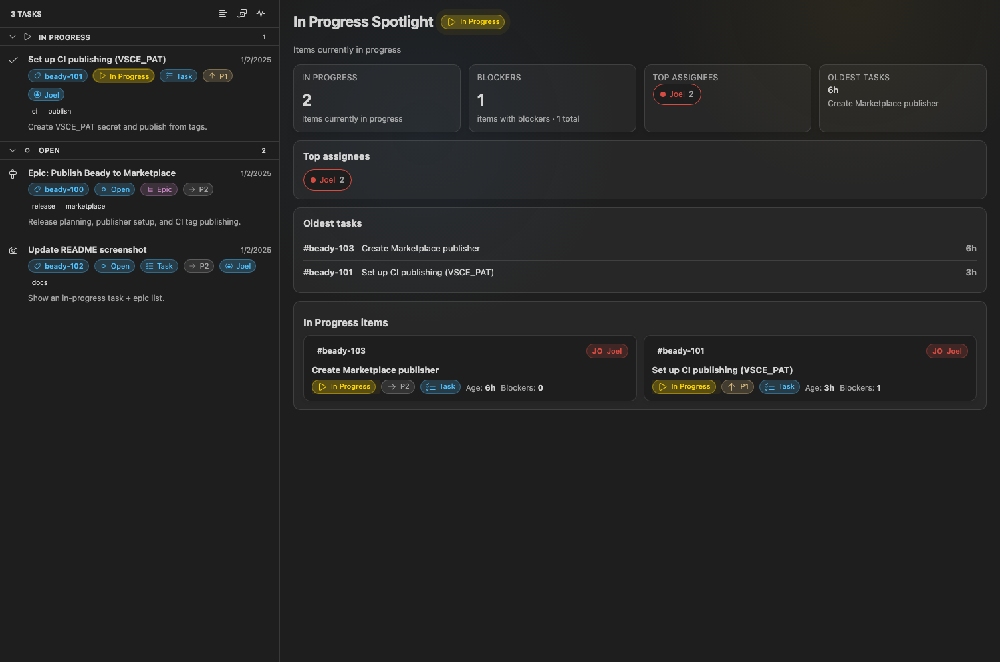

# Beady Project Manager

[](https://marketplace.visualstudio.com/items?itemName=klabo.beady)
[](https://marketplace.visualstudio.com/items?itemName=klabo.beady)
[](https://marketplace.visualstudio.com/items?itemName=klabo.beady)
[](LICENSE)
[](https://github.com/joelklabo/beady/actions/workflows/test.yml)

> Worktree-friendly issue tracker for VS Code — browse issues, dependencies, and activity from your [Beads](https://github.com/steveyegge/beads) database.

<p align="center">
  <a href="https://marketplace.visualstudio.com/items?itemName=klabo.beady">
    
  </a>
  &nbsp;
  <a href="https://insiders.vscode.dev/redirect?extensionId=klabo.beady">
    
  </a>
</p>

---

## Screenshot



## Features

### 📋 Task Management
- **Browse issues** directly in the VS Code sidebar
- **Create, update, and close** issues without leaving your editor
- **Drag-and-drop** to reorder and organize tasks
- **Quick filters** for status, priority, assignee, and labels
- **Search** across all issues instantly

### 🔗 Dependency Visualization
- **Interactive dependency graph** to visualize relationships
- **Dependency tree view** showing upstream/downstream links
- **Cycle detection** to prevent circular dependencies

### 📊 Activity Feed
- **Real-time activity tracking** for all issue changes
- **Filter by event type** (created, updated, closed)
- **Quick navigation** to related issues

### 🤖 AI-Powered Workflows
- **@task-creator** — Turn feature requests into complete epic + task trees
- **@task-worker** — Continuously work through issues until none remain

### 🌳 Worktree Support
- **Multi-agent friendly** — designed for parallel development with git worktrees
- **Worktree guard** prevents duplicate work and unsafe mutations
- **Branch-aware** status indicators

---

## Installation

### From VS Code Marketplace

1. Open VS Code
2. Press `Ctrl+Shift+X` (Windows/Linux) or `Cmd+Shift+X` (macOS)
3. Search for "Beady"
4. Click **Install**

Or use the quick install links:

<p>
  <a href="vscode:extension/klabo.beady">
    
  </a>
  &nbsp;
  <a href="vscode-insiders:extension/klabo.beady">
    
  </a>
</p>

### Prerequisites

- **VS Code** 1.90.0 or later
- **[Beads CLI](https://github.com/steveyegge/beads)** (`bd`) installed and available in your PATH

```bash
# Install the Beads CLI
npm install -g @beads/bd
```

---

## Quick Start

1. **Initialize a Beads database** in your project:
   ```bash
   bd init
   ```

2. **Open the Beady sidebar** by clicking the Beady icon in the Activity Bar

3. **Create your first issue**:
   - Click the `+` button in the toolbar, or
   - Run `Beady: Create Issue` from the Command Palette (`Ctrl+Shift+P`)

4. **Browse and manage** your issues directly in VS Code!

---

## Configuration

Configure Beady in your VS Code settings (`settings.json`):

```jsonc
{
  // Path to the bd CLI (default: "bd")
  "beady.commandPath": "bd",

  // Override the project root for bd commands
  "beady.projectRoot": "",

  // Path to the Beads data file (relative or absolute)
  "beady.dataFile": ".beads/issues.jsonl",

  // Highlight in-progress tasks after this many minutes
  "beady.staleThresholdMinutes": 10,

  // Enable worktree guard for multi-agent safety
  "beady.enableWorktreeGuard": true
}
```

<details>
<summary><strong>All Configuration Options</strong></summary>

| Setting | Default | Description |
|---------|---------|-------------|
| `beady.commandPath` | `"bd"` | Path to the bd CLI executable |
| `beady.projectRoot` | `""` | Override project root for bd commands |
| `beady.dataFile` | `".beads/issues.jsonl"` | Path to the Beads data file |
| `beady.staleThresholdMinutes` | `10` | Minutes before in-progress tasks are flagged as stale |
| `beady.enableWorktreeGuard` | `true` | Run worktree guard before mutations |
| `beady.enableDependencyEditing` | `false` | Enable experimental dependency editing UI |
| `beady.activityFeed.enabled` | `true` | Enable the activity feed view |
| `beady.quickFilters.enabled` | `false` | Enable quick filter presets |
| `beady.bulkActions.enabled` | `false` | Enable bulk status/label actions |
| `beady.favorites.enabled` | `false` | Enable favorites toggling |
| `beady.cli.timeoutMs` | `15000` | Timeout for bd CLI commands |
| `beady.cli.retryCount` | `1` | Retry count for failed commands |

</details>

---

## Commands

Access commands via the Command Palette (`Ctrl+Shift+P` / `Cmd+Shift+P`):

| Command | Description |
|---------|-------------|
| `Beady: Refresh` | Refresh the issues view |
| `Beady: Create Issue` | Create a new issue |
| `Beady: Search` | Search issues by title, ID, or content |
| `Beady: Visualize Dependencies` | Open the dependency graph |
| `Beady: Toggle Sort Mode` | Cycle through sort modes |
| `Beady: Export to CSV` | Export issues to CSV (experimental) |
| `Beady: Export to Markdown` | Export issues to Markdown (experimental) |

---

## For AI Coding Agents

Beady is designed to work seamlessly with AI coding agents in multi-worktree environments. Key points:

- **Always use `--no-daemon`** with bd CLI commands in worktrees
- Use `bd ready --json` to find unblocked work
- Check for file conflicts before starting tasks
- Run `bd sync` at the end of agent sessions

See [AGENTS.md](https://github.com/joelklabo/beady/blob/main/AGENTS.md) for the complete agent workflow guide.

---

## Development

```bash
# Install dependencies
npm install

# Compile TypeScript
npm run compile

# Watch mode for development
npm run watch

# Run tests
npm run test:unit

# Bundle for production
npm run bundle

# Package as VSIX
npm run package
```

See [CONTRIBUTING.md](https://github.com/joelklabo/beady/blob/main/CONTRIBUTING.md) for detailed contribution guidelines.

---

## Related Projects

- **[Beads](https://github.com/steveyegge/beads)** — The lightweight issue tracker for AI coding agents
- **[@beads/bd](https://www.npmjs.com/package/@beads/bd)** — The Beads CLI tool

---

## License

[MIT](LICENSE) © Beady Contributors

---

<p align="center">
  Made with ❤️ for AI-assisted development
</p>
